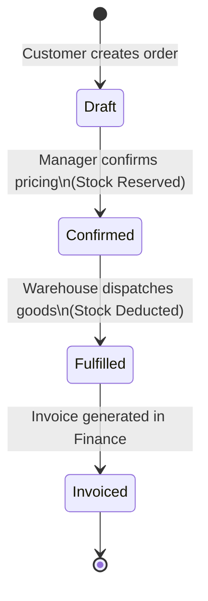
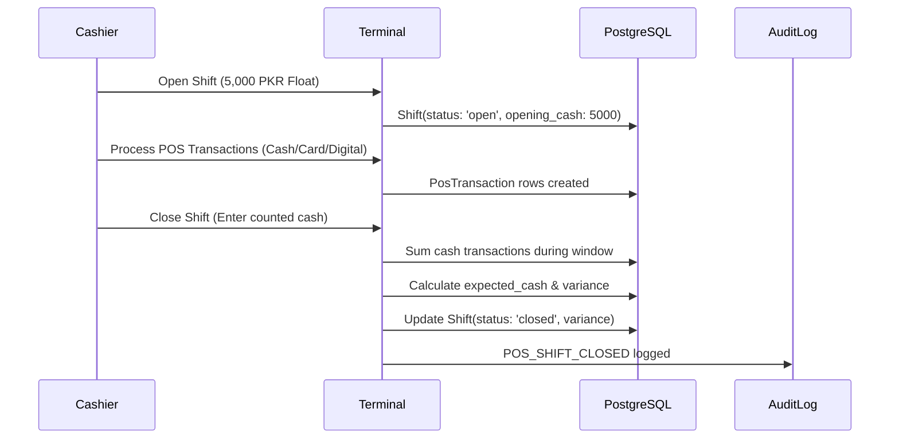

# NexERP — Sales Module Architecture & State Invariants

This document outlines the architectural patterns, state machines, and inventory invariants governing the Sales Management module.

---

## 1. Wholesale Order State Machine

### Invariants:
1. **Draft**: Line items and negotiated prices can be edited freely. No stock is touched.
2. **Confirmed**: Pricing is locked. `StockLevel.quantity_reserved += item.qty` across specified variants.
3. **Fulfilled**: `StockLevel.quantity_on_hand -= item.qty`, `StockLevel.quantity_reserved -= item.qty`. Immutable `StockMovement` logged with `movement_type: 'sale'`.
4. **Invoiced**: Linked `Invoice` row created with `entity_type: 'sale'`.

---

## 2. Shift Reconciliation Lifecycle

---

## 3. Double-Refund Protection Invariant

For any POS Transaction $T$:
$$\sum \text{Refund.amount} \le T.\text{total}$$

If a cashier attempts to refund line items whose cumulative total exceeds $T.\text{total} - \sum \text{prior\_refunds}$, the transaction is rejected with `HTTP 400`.
When authorized, `StockLevel.quantity_on_hand` is incremented and a `StockMovement` record with `movement_type: 'return'` is recorded.
