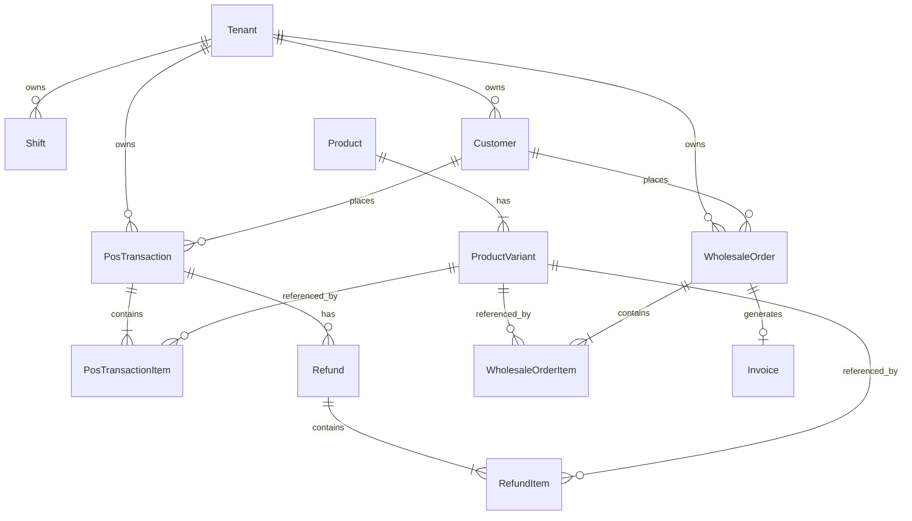

# NexERP — Sales Management System

A production-grade, multi-tenant enterprise Sales Management module for **NexERP**, delivering high-throughput retail Point-of-Sale (POS), end-to-end B2B wholesale order lifecycles, real-time inventory synchronization, customer credit CRM, and financial analytics.

---

## 📑 Table of Contents

1. [System Overview](#-system-overview)
2. [Key Architecture Principles](#-key-architecture-principles)
3. [Core Sub-Modules & Feature Matrix](#-core-sub-modules--feature-matrix)
   - [Point of Sale (POS) Terminal](#1-point-of-sale-pos-terminal)
   - [Cashier Register & Shift Management](#2-cashier-register--shift-management)
   - [Transaction History & Stock-Reversing Refunds](#3-transaction-history--stock-reversing-refunds)
   - [B2B Wholesale Order Lifecycle](#4-b2b-wholesale-order-lifecycle)
   - [Sales Intelligence & Analytics Dashboard](#5-sales-intelligence--analytics-dashboard)
   - [Customer CRM & Credit Accounts](#6-customer-crm--credit-accounts)
4. [State Machines & Invariants](#-state-machines--invariants)
5. [Database Schema & Entity Relationships](#-database-schema--entity-relationships)
6. [API Specification Summary](#-api-specification-summary)
7. [Directory Structure](#-directory-structure)
8. [Getting Started & Local Development](#-getting-started--local-development)

---

## 🌟 System Overview

The Sales Management module powers both high-speed retail checkout counters and corporate B2B wholesale channels. It is engineered with strict multi-tenant isolation, server-authoritative price verification, automatic stock reservation/deduction, and financial integration with the NexERP Finance and Inventory subsystems.

```
┌────────────────────────────────────────────────────────────────────────────────────────┐
│                              NexERP Sales Subsystem                                    │
├──────────────────────────┬─────────────────────────────┬───────────────────────────────┤
│    Retail POS Channel    │    B2B Wholesale Channel    │     Enterprise Operations     │
├──────────────────────────┼─────────────────────────────┼───────────────────────────────┤
│ • Instant Barcode Lookup │ • Multi-Item Quote Builder  │ • Live KPI Analytics & Charts │
│ • Multi-Currency / PKR   │ • Negotiated Custom Pricing │ • Customer Credit Governance  │
│ • Split Payment Methods  │ • 4-Stage State Machine     │ • Supervisor-Audited Refunds  │
│ • Printable Tax Invoices │ • Stock Reservation System  │ • Immutable Audit Logging     │
│ • Cashier Register Gates │ • Auto-Invoice to Finance   │ • Offline DevStore Fallback   │
└──────────────────────────┴─────────────────────────────┴───────────────────────────────┘
```

---

## 🛡️ Key Architecture Principles

1. **Multi-Tenant Isolation (RLS)**: Every query, transaction, and mutation strictly enforces tenant boundaries using `session.tenantId` extracted from signed JWT cookie sessions.
2. **Server-Authoritative Pricing**: Client-side cart prices are never trusted blindly. During checkout and order placement, the server resolves prices against `ProductVariant.selling_price` or `Product.default_price`.
3. **Financial Precision with BigInt**: All monetary values (subtotals, taxes, discounts, totals, refunds) are stored as integer currency units (`BigInt` / PKR) to eliminate IEEE 754 floating-point inaccuracies.
4. **Idempotency & Concurrency Safety**: All write endpoints accept an `x-idempotency-key` header to prevent duplicate charge submissions during network retries.
5. **Immutable Stock Movement Auditing**: Every inventory deduction or return writes an immutable `StockMovement` ledger entry tied to the cashier and originating transaction/order.
6. **Zero-Downtime DevStore Fallbacks**: When developing in offline mode or during database maintenance, all API routes seamlessly serve an in-memory singleton (`@/lib/dev-store.ts`) with zero runtime crashes.

---

## 📦 Core Sub-Modules & Feature Matrix

### 1. Point of Sale (POS) Terminal
- **Route**: `apps/web/app/(dashboard)/sales/pos/page.tsx`
- **API**: `POST /api/sales/checkout`, `GET /api/inventory/products`, `GET /api/sales/customers`
- **Features**:
  - Real-time catalog search with instant SKU, name, and barcode filtering.
  - Interactive grid tiles displaying stock availability, variant badges (Size/Color), and unit pricing.
  - Line-item quantity increment/decrement, dynamic subtotal, 17% sales tax calculation, and discounts.
  - Customer CRM linking (Retail & Wholesale customer credit checks).
  - Multi-payment support: **Cash**, **Card**, **JazzCash**, **Easypaisa**, and **Customer Credit / On Account**.
  - Instant printable thermal receipt modal with branded header, breakdown, and receipt number.

### 2. Cashier Register & Shift Management
- **Route**: `apps/web/app/(dashboard)/sales/shift/page.tsx`
- **API**: `GET /api/sales/shifts/current`, `POST /api/sales/shifts/open`, `POST /api/sales/shifts/close`
- **Features**:
  - One-click register unlock and shift initialization.
  - Terminal code assignment (`POS-01`) linked to the authenticated cashier session.
  - Automatic gating banner on POS terminal ensuring sales are performed under an active register session.
  - Safe shift closing with audit logging (`POS_SHIFT_CLOSED`).

### 3. Transaction History & Stock-Reversing Refunds
- **Route**: `apps/web/app/(dashboard)/sales/history/page.tsx`
- **API**: `GET /api/sales/transactions`, `POST /api/sales/refunds`
- **Features**:
  - Searchable transaction ledger with filters for receipt number, date range, and payment method.
  - Receipt detail preview and re-print functionality.
  - **Granular Line-Item Refunds**: Select individual items and quantities to refund.
  - **Stock Reversal**: Automatically returns refunded items back to `StockLevel.quantity_on_hand` and logs `StockMovement(movement_type: 'return')`.
  - **Anti-Double-Refund Protection**: Enforces server-side guard verifying $\sum \text{Refunds} \le \text{Transaction Total}$.

### 4. B2B Wholesale Order Lifecycle
- **Routes**: `apps/web/app/(dashboard)/sales/wholesale/page.tsx`, `.../wholesale/new/page.tsx`
- **API**: `GET /api/sales/wholesale-orders`, `POST /api/sales/wholesale-orders`, `PATCH .../[id]/confirm`, `PATCH .../[id]/fulfill`, `POST .../[id]/generate-invoice`
- **Features**:
  - Commercial order composer with customer selection, credit limit indicator, and custom negotiated pricing.
  - Multi-stage state workflow (`Draft` $\rightarrow$ `Confirmed` $\rightarrow$ `Fulfilled` $\rightarrow$ `Invoiced`).
  - Automatic stock reservation on confirmation (`StockLevel.quantity_reserved`).
  - Automatic inventory deduction on fulfillment (`StockLevel.quantity_on_hand` reduced).
  - Direct integration with NexERP Finance module: One-click generation of official 30-day term `Invoice`.

### 5. Sales Intelligence & Analytics Dashboard
- **Route**: `apps/web/app/(dashboard)/sales/page.tsx`
- **API**: `GET /api/sales/dashboard`
- **Features**:
  - Real-time KPI summary cards: **Today's Revenue**, **Yesterday Comparison & Growth %**, **Orders Count**, **Average Ticket Size**, and **Active Customers**.
  - **7-Day Revenue Trajectory**: Interactive smooth Area Chart built with Recharts.
  - **Payment Channel Distribution**: Comparative bar chart breakdown (Cash, Card, Digital wallets).
  - **Top Performing Catalog Items**: Revenue and unit volume leaderboards.

### 6. Customer CRM & Credit Accounts
- **API**: `GET /api/sales/customers`, `POST /api/sales/customers`
- **Features**:
  - Unified customer profiles supporting both Retail walk-ins and Wholesale corporate buyers.
  - Credit limit thresholds, payment terms, and phone/email indexing.

---

## 🔄 State Machines & Invariants

### Wholesale Order Lifecycle

```mermaid
stateDiagram-v2
    [*] --> Draft : Sales Rep drafts order
    Draft --> Confirmed : Manager locks pricing & approves
    note right of Confirmed : Stock Reserved\n(quantity_reserved += qty)
    Confirmed --> Fulfilled : Warehouse dispatches goods
    note right of Fulfilled : Stock Deducted\n(quantity_on_hand -= qty,\nquantity_reserved -= qty,\nStockMovement: sale)
    Fulfilled --> Invoiced : Finance Invoice generated
    note right of Invoiced : Creates Finance Invoice\n(entity_type: sale, status: sent)
    Invoiced --> [*]
```

### Double-Refund Prevention Guard

For any POS transaction $T$:
$$\text{Max Refundable} = T.\text{total} - \sum_{r \in T.\text{refunds}} r.\text{amount}$$

$$\text{Requested Refund} \le \text{Max Refundable}$$

If the requested refund exceeds the remaining refundable balance, the server rejects the request with `HTTP 400 Bad Request`.

---

## 🗄️ Database Schema & Entity Relationships

The Sales module extends Prisma PostgreSQL models in `packages/db/prisma/schema.prisma`:



### Core Schema Highlights:
- **`PosTransaction`**: `id`, `tenant_id`, `cashier_id`, `terminal_id`, `subtotal`, `tax_amount`, `discount_amount`, `total`, `payment_method`, `sync_status`.
- **`Shift`**: `id`, `tenant_id`, `cashier_id`, `terminal_id`, `opening_cash`, `closing_cash`, `expected_cash`, `variance`, `status` (`open` | `closed`), `opened_at`, `closed_at`.
- **`Refund`** & **`RefundItem`**: `id`, `transaction_id`, `reason` (`defective` | `wrong_item` | `customer_return` | `other`), `amount`, `refund_method`.
- **`WholesaleOrder`** & **`WholesaleOrderItem`**: `id`, `customer_id`, `total_amount`, `status` (`draft` | `confirmed` | `fulfilled` | `invoiced` | `cancelled`), `idempotency_key`.

---

## 🔌 API Specification Summary

All routes are authenticated via session cookie and located under `apps/web/app/api/sales/`:

| Method | Endpoint | Description | Request / Response Summary |
|---|---|---|---|
| `GET` | `/api/sales/dashboard` | Sales KPIs, 7-day revenue trend, top products | `{ success: true, metrics, revenueTrend, topSelling }` |
| `GET` | `/api/sales/customers` | List retail and wholesale customers | Query: `?type=wholesale&search=ABC` |
| `POST` | `/api/sales/customers` | Register new customer account | Body: `{ name, phone, email, customer_type, credit_limit }` |
| `GET` | `/api/sales/shifts/current` | Active cashier register session status | `{ success: true, hasActiveShift, activeShift }` |
| `POST` | `/api/sales/shifts/open` | Open register shift session | Body: `{ openingCash: 0 }` |
| `POST` | `/api/sales/shifts/close` | End register shift session | Body: `{ shiftId, closingCash: 0 }` |
| `POST` | `/api/sales/checkout` | Process retail sale & deduct stock | Body: `{ items: [{ variantId, quantity }], paymentMethod, customerId }` |
| `GET` | `/api/sales/transactions` | Query historical sales ledger | Query: `?search=INV-123&paymentMethod=cash` |
| `POST` | `/api/sales/refunds` | Process line-item refund & return stock | Body: `{ transactionId, items: [{ variantId, quantity }], reason }` |
| `GET` | `/api/sales/wholesale-orders` | Fetch B2B orders with invoice status | Query: `?status=confirmed&customerId=...` |
| `POST` | `/api/sales/wholesale-orders` | Create new wholesale order | Body: `{ customerId, items: [{ variantId, quantity, unitPrice }], status }` |
| `PATCH` | `/api/sales/wholesale-orders/:id/confirm` | Confirm order & reserve stock | Returns updated order (`status: 'confirmed'`) |
| `PATCH` | `/api/sales/wholesale-orders/:id/fulfill` | Dispatch order & deduct stock | Returns updated order (`status: 'fulfilled'`) |
| `POST` | `/api/sales/wholesale-orders/:id/generate-invoice` | Create Finance Invoice row | `{ success: true, invoice: { invoiceNumber, amount, dueDate } }` |

---

## 📂 Directory Structure

```
sales-management/
├── README.md               # Complete System Documentation (This file)
├── ARCHITECTURE.md         # State machines, sequence diagrams & mathematical invariants
└── API_SPEC.md             # REST API contract definitions

apps/web/
├── lib/
│   ├── auth-session.ts     # Cookie-based JWT auth verification
│   ├── audit.ts            # Audit logging client
│   └── dev-store.ts        # Zero-downtime offline fallback singleton
└── app/
    ├── (dashboard)/sales/
    │   ├── page.tsx        # Sales Analytics & Realtime KPIs
    │   ├── pos/page.tsx    # POS Retail Terminal & Instant Checkout
    │   ├── shift/page.tsx  # Register Shift Management
    │   ├── history/page.tsx# Transaction Ledger & Line-Item Refunds
    │   └── wholesale/
    │       ├── page.tsx    # Wholesale Order Management & Lifecycle
    │       └── new/page.tsx# B2B Wholesale Order Composer
    └── api/
        ├── inventory/products/route.ts  # Authoritative Catalog & Pricing
        └── sales/
            ├── dashboard/route.ts       # Analytics Aggregator
            ├── customers/route.ts       # Customer CRM Endpoint
            ├── checkout/route.ts        # POS Atomic Checkout
            ├── transactions/route.ts    # Sales History Ledger
            ├── refunds/route.ts         # Stock-Reversing Refunds
            ├── shifts/
            │   ├── current/route.ts     # Active Shift Checker
            │   ├── open/route.ts        # Shift Opener
            │   └── close/route.ts       # Shift Closer
            └── wholesale-orders/
                ├── route.ts             # Orders Query & Creation
                └── [id]/
                    ├── confirm/route.ts # Stock Reservation
                    ├── fulfill/route.ts # Stock Deduction & Dispatch
                    └── generate-invoice/route.ts # Finance Invoicing
```

---

## 🚀 Getting Started & Local Development

### 1. Prerequisites
- **Node.js**: `v20+` or `v22+`
- **pnpm**: `v9+` or `v10+`
- **PostgreSQL / Docker** (Optional — offline `devStore` fallback operates automatically if database is offline)

### 2. Installation & Type Checking
```bash
# Install dependencies across all monorepo workspaces
pnpm install

# Generate Prisma Client models (including Shift, Refund, WholesaleOrder)
pnpm --filter @repo/db db:generate

# Run full TypeScript validation
pnpm check-types
```

### 3. Launch Development Server
```bash
# Start Turbopack dev server on http://localhost:3000
pnpm dev
```

### 4. Navigating the Module
- **POS Terminal**: Visit [`http://localhost:3000/sales/pos`](http://localhost:3000/sales/pos) to ring up sales and print receipts.
- **Sales Analytics**: Visit [`http://localhost:3000/sales`](http://localhost:3000/sales) for live performance charts.
- **Wholesale Channel**: Visit [`http://localhost:3000/sales/wholesale`](http://localhost:3000/sales/wholesale) to track commercial orders.
- **Shift Management**: Visit [`http://localhost:3000/sales/shift`](http://localhost:3000/sales/shift) to open or close register sessions.
- **Transactions & Refunds**: Visit [`http://localhost:3000/sales/history`](http://localhost:3000/sales/history) to inspect past receipts and issue returns.

---

*NexERP Sales Module — Built with Next.js 16 App Router, TypeScript, Tailwind CSS, Prisma ORM, and Recharts.*
